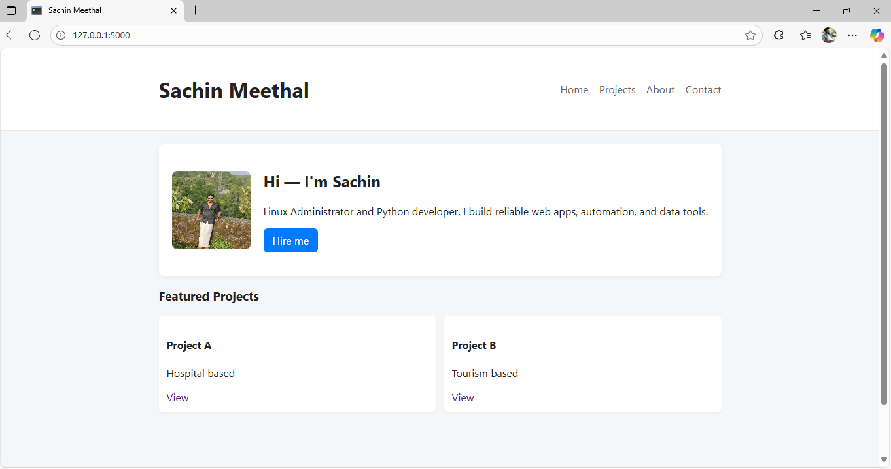

# task6-portfolio
my portfolio
#  Personal Portfolio Website (Flask Project)

##  Objective
A simple personal portfolio website built using **Python**, **Flask**, **HTML**, and **CSS**.  
It showcases personal information, projects, and includes a contact form where visitors can send messages.

---

##  Tools & Technologies
- Python 3.x  
- Flask (Web Framework)  
- HTML5 & CSS3  
- Jinja2 Templating Engine  

---

##  Project Structure
portfolio/
├── app.py
├── requirements.txt
├── contacts.csv # Stores contact form submissions
├── templates/
│ ├── base.html
│ ├── index.html
│ ├── projects.html
│ ├── about.html
│ └── contact.html
└── static/
├── css/
│ └── style.css
└── images/
└── profile.jpg


---

##  Features
 Home page with a personal introduction and profile image  
 Projects page listing completed work  
 About page describing background and skills  
 Contact page with a working form that saves messages to `contacts.csv`  
 Clean and responsive layout using custom CSS  

---

##  Setup Instructions

### 1️ Clone the Repository
```bash
git clone https://github.com/sachin-meethal/portfolio.git
cd portfolio


Contact Form

The contact form stores submissions in a CSV file (contacts.csv) located in the project root directory.

Each submission includes:

Timestamp (UTC)

Name

Email

Message

 Learning Outcome

This project demonstrates how to:

Create a Flask app with routing

Use HTML templates with Jinja2

Handle form submissions in Flask

Store data in CSV files

Build and organize a basic Flask web project


##  Screenshots

###  Home Page


###  Projects Page


###  About Page


###  Contact Page


